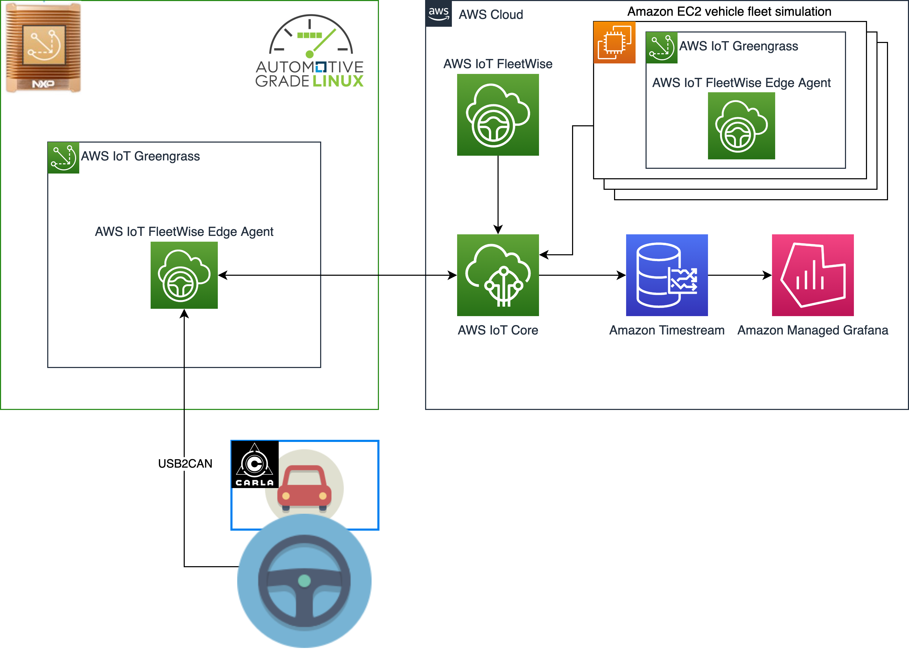

# Welcome to the AWS IoT Fleetwise demo

This demo aims to exhibit how [AWS IoT Fleetwise](https://aws.amazon.com/iot-fleetwise) can make it easy and cost effective to collect, transform, and transfer vehicle data to the cloud in near-real time and use it to build applications with analytics and machine learning that improve vehicle quality, safety, and autonomy.



In this demo, we simulate two kind of vehicles:
- An [NXP GoldBox](https://www.nxp.com/design/development-boards/automotive-development-platforms/goldbox-for-vehicle-networking-development-platform:GOLDBOX) powered by an [Automotive Grade Linux](https://www.automotivelinux.org/) distribution that runs the AWS IoT FleetWise agent as a [AWS IoT Greengrass component](https://docs.aws.amazon.com/greengrass/v2/developerguide/develop-greengrass-components.html). The agent has access to one of the NXP GoldBoX CAN interfaces which is connected to a PC, equipped with a USB to CAN Adapter. The PC generates CAN signals from a virtual vehicle in [CARLA Simulator](https://carla.org/). The vehicle in CARLA can self drive or be driven with game steering wheel connected to a PC.
- A completely virtual vehicle, implemented as a [AWS Graviton](https://aws.amazon.com/ec2/graviton) ARM based EC2 instance powered by a ubuntu linux distribution. In this EC2 instance, we have both the AWS IoT FleetWise agent and a process that generate random signals that are sent on a virtual CAN bus where the agent is listening on.

You can run the demo using one or both the simulated vehicles.

Data is collected by AWS Iot FleetWise and stored in [Amazon Timestream](https://aws.amazon.com/timestream) table and visualized on a Grafana Dashboard.


Data from the vehicles can be collected using [Campaigns](https://docs.aws.amazon.com/iot-fleetwise/latest/developerguide/campaigns.html). In this demo, we collect data on a regular time basis as well as in response to certain events such is in case of a crash.

This repository includes all the code, written using CDK in Python, to reproduce the demo in your AWS account and leverage the [CDK Iot Fleetwise L2 Construct library](https://github.com/aws-samples/cdk-aws-iotfleetwise).

## Getting started 
Clone this repository and issue the following commands to bootstrap cdk in your default aws profile account/region. 
> :warning: **At the time of writing, AWS Iot FleetWise is only available in preview only in us-east-1 and eu-central-1 so be sure to use one of the mentioned region to run the demo on**

If CDK cli is not installed please do the following

```sh
npm install -g aws-cdk
npx cdk bootstrap --cloudformation-execution-policies \
  arn:aws:iam::aws:policy/AdministratorAccess 
```

[Create an EC2 key pair](https://docs.aws.amazon.com/AWSEC2/latest/UserGuide/create-key-pairs.html#having-ec2-create-your-key-pair) called `mykey` that could be used to access to the EC2 vehicle simulator.

Create a virtualenv on MacOS and Linux:

```sh
cd demo-auto-aws-iotfleetwise
python3 -m venv .venv
source .venv/bin/activate
pip install -r requirements.txt
```

At this point you can now deploy the stack

```sh
cdk deploy demo-auto-aws-iotfleetwise -c key_name=mykey
```

The deployments takes about 20 min. Once deployment is completed, you will see the URL where to connect to the grafana dashboard and the command on how to retrive the `admin` user password from [AWS Secrets Manager](https://aws.amazon.com/secrets-manager/).

## Clean up
> :warning: Deploying this demo in your AWS account will create and consume AWS resources, which will cost money. Therefore, to avoid ongoing charges, be sure to follow the instructions below to delete all the resource.

```sh
cdk destroy demo-auto-aws-iotfleetwise -c key_name=mykey
```

## Security

See [CONTRIBUTING](CONTRIBUTING.md#security-issue-notifications) for more 
information.

## License

This code is licensed under the MIT-0 License. See the LICENSE file.

